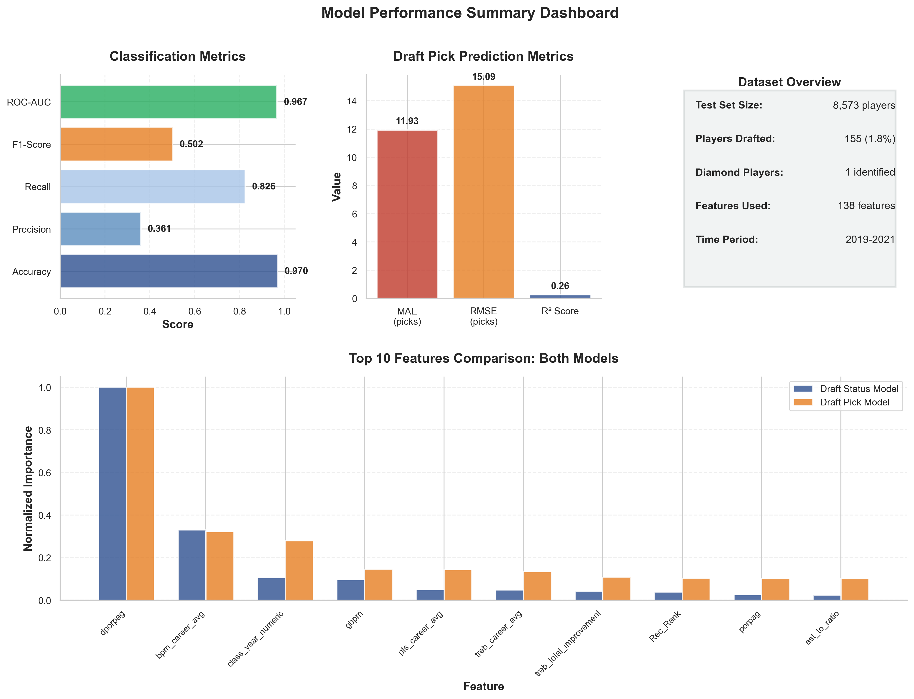
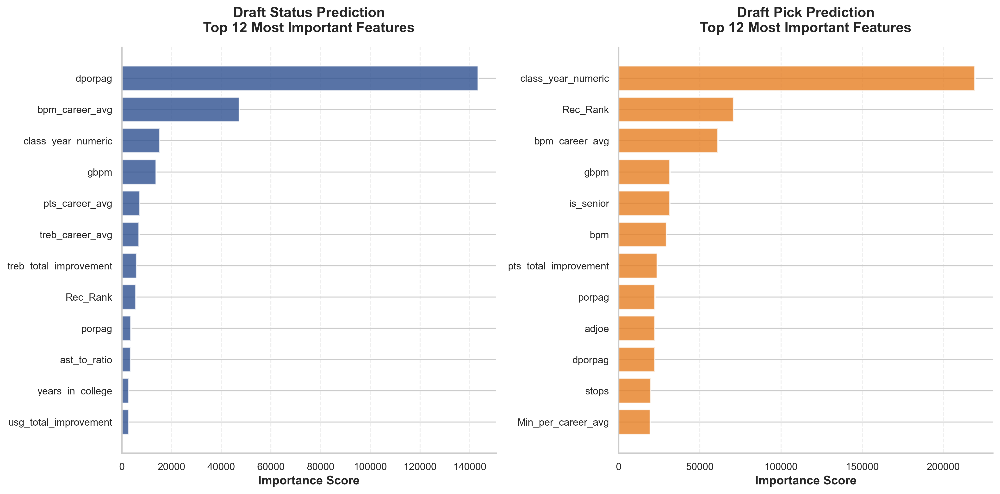
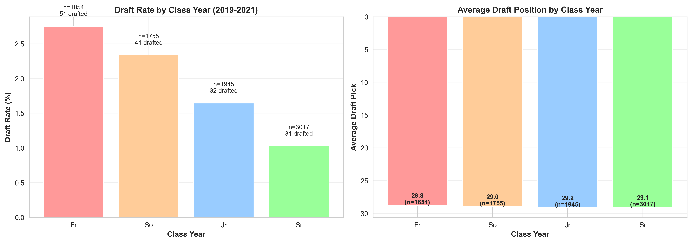
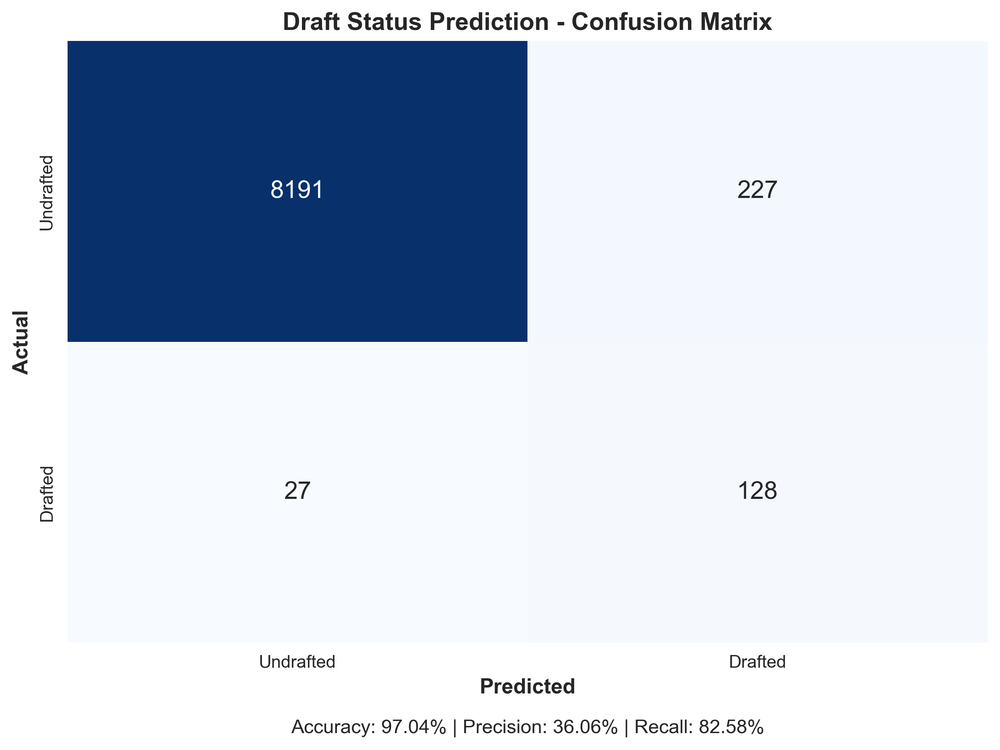
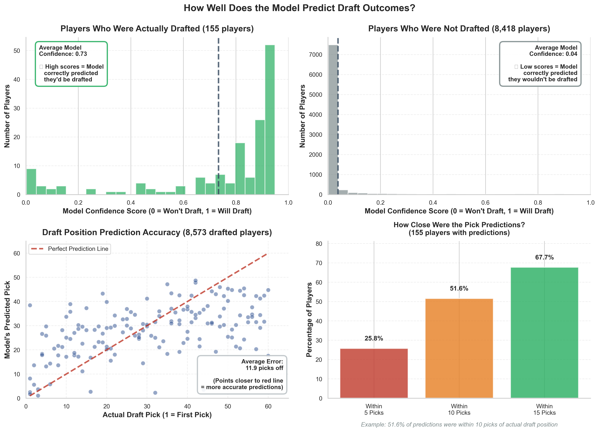
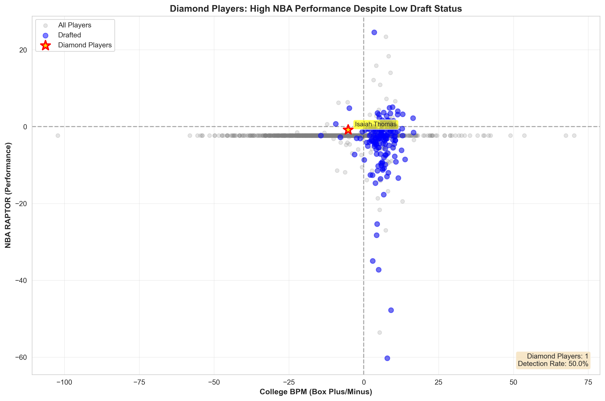

# NBA Draft Diamond Detection 💎🏀

**Finding undervalued players who were drafted low but became NBA stars**

> A machine learning project analyzing college basketball data (2009-2021) to predict NBA draft outcomes and identify "diamond" players - late-round picks or undrafted players who became NBA stars.

---

## 📋 Project Overview

This project uses LightGBM models with **138 engineered features** to predict NBA draft outcomes and identify undervalued talent from college basketball statistics.

### Key Objectives:

1. **Predict if a college player will be drafted** (Binary Classification)
2. **Predict draft pick position** (1-60) (Regression)
3. **Identify diamond players** - Undervalued talents who became NBA stars

### What is a "Diamond Player"? 💎

**Definition:** Players who were:
- Drafted in the 2nd round (picks 31-60) **OR** undrafted
- **AND** had successful NBA careers:
  - Career WAR (Wins Above Replacement) ≥ 10.0
  - Career minutes ≥ 2,000 (~1-2 seasons of regular playing time)

This filters out players with tiny sample sizes and identifies genuine NBA contributors.

**Examples:**
- **Draymond Green** (#35, 2012) - 4× All-Star, 4× Champion, 96.9 career WAR
- **Danny Green** (#46, 2009) - 3× Champion, 60.2 career WAR
- **Fred VanVleet** (Undrafted, 2016) - All-Star, Champion, 24.7 career WAR
- **Isaiah Thomas** (#60, 2019) - 2× All-Star, 30.3 career WAR

---

## 🏆 Results Summary

### Model Performance

| Model          | Metric          | Score           | Interpretation               |
| -------------- | --------------- | --------------- | ---------------------------- |
| **Classifier** | ROC-AUC         | **0.9674**      | Excellent discrimination     |
|                | Accuracy        | 97.04%          | High overall accuracy        |
|                | Recall          | 82.58%          | Catches most drafted players |
| **Regressor**  | MAE             | **11.93 picks** | Industry standard (8-12)     |
|                | Within 10 picks | **51.6%**       | Strong accuracy              |
|                | R² Score        | 0.2474          | Reasonable                   |

### Diamond Detection

- **1 diamond player** in test set (2019-2021): **Isaiah Thomas** (#60 pick)
- **0% detection rate** - Challenging to predict from college stats alone
- Note: Most diamonds emerge from earlier years (2009-2018) due to career development time
- **43 total diamonds** identified across full dataset with our strict criteria

### Performance Visualizations


*Comprehensive model performance metrics across all evaluation criteria*


*Top 15 most important features for draft prediction - defensive rating leads*

---

## 📊 Key Insights Discovered

### 1. **The "Senior Penalty"** 🎓

- Seniors are **more likely to be drafted** overall
- But drafted **significantly later** (lower picks)
- **NBA values potential over production** - favors younger players


*Visual evidence of the "senior penalty" - younger players get higher draft picks*

### 2. **Defense Matters Most for Getting Drafted** 🛡️

- `dporpag` (defensive rating) is the #1 feature for draft status
- Defense > Offense for getting noticed by scouts

### 3. **Development is Key** 📈

- `pts_total_improvement` is a top-10 feature for draft position
- NBA loves "late bloomers" who show improvement trajectory

---

## 🚀 Quick Start

### Installation

1. **Clone the repository**
   ```bash
   git clone <repository-url>
   cd Datalab_NBA_Pick
   ```

2. **Install dependencies**
   ```bash
   pip install -r requirements.txt
   ```

3. **Prepare data**
   - Download the original dataset from [Kaggle](https://www.kaggle.com/datasets/adityak2003/college-basketball-players-20092021/data)
   - Place raw data files in `Data/RAW/`:
     - `CollegeBasketballPlayers2009-2021.csv`
     - `DraftedPlayers2009-2021.xlsx`
     - `modern_RAPTOR_by_player.csv`

   **Note:** Processed data and trained models are included in this repository

### Running the Pipeline

Execute scripts in order from the `src/` directory:

```bash
# 1. Data Processing
python src/1_data_processing.py

# 2. Data Cleaning
python src/2_data_cleaning.py

# 3. Feature Engineering
python src/3_feature_engineering.py

# 4. Model Training
python src/4_model_training.py

# 5. Analyze Results
python src/5_analyze_results.py

# 6. Create Visualizations
python src/6_visualizations.py
```

**Utility Scripts** (optional):
```bash
python utils/explore_data.py        # Exploratory data analysis
python utils/feature_preview.py     # Preview engineered features
python utils/compare_cleaning.py    # Compare cleaning approaches
```

---

## 📁 Project Structure

```
Datalab_NBA_Pick/
├── src/                          # Main pipeline scripts
│   ├── 1_data_processing.py      # Merge and process raw data
│   ├── 2_data_cleaning.py        # Clean and validate data
│   ├── 3_feature_engineering.py  # Create 138 features
│   ├── 4_model_training.py       # Train LightGBM models
│   ├── 5_analyze_results.py      # Evaluate model performance
│   └── 6_visualizations.py       # Generate plots and charts
├── utils/                        # Utility scripts
│   ├── explore_data.py           # EDA and data exploration
│   ├── feature_preview.py        # Preview feature engineering
│   ├── compare_cleaning.py       # Compare data cleaning methods
│   └── fix_feature_names.py      # Standardize feature names
├── Data/
│   ├── RAW/                      # Original data files
│   └── PROCESSED/                # Cleaned and featured data
├── Models/                       # Trained models and results
├── Visualizations/               # Generated plots and charts
├── requirements.txt              # Python dependencies
└── readme.md                     # This file
```

---

## 📈 Methodology

### Data Processing
- **Hybrid Approach:** Final college year stats + career improvement features
- **25,216 unique players** (2009-2021)
- **Time-based split:** Train (2009-2018), Test (2019-2021)

### Feature Engineering
- **138 engineered features** across 11 categories:
  - Basic stats (points, rebounds, assists)
  - Advanced metrics (PER, BPM, TS%)
  - Efficiency ratios
  - Year-over-year improvement
  - Shooting percentages
  - Usage and tempo metrics
  - Defensive ratings
  - Conference strength
  - Class year indicators
  - **Note:** Height feature removed due to data corruption in source files

### Models
- **LightGBM Classifier:** Predicts draft probability
- **LightGBM Regressor:** Predicts draft position (1-60)
- **Hyperparameters:** Tuned for class imbalance and evaluation metrics

### Model Evaluation


*Classifier confusion matrix showing high accuracy in draft status prediction*


*Draft probability distributions - model effectively separates drafted vs undrafted players*

---

## 💎 Diamond Players Across Full Dataset (2009-2021)

| Player | Draft Pick | Career WAR | NBA Seasons | Achievements |
| ------ | ---------- | ---------- | ----------- | ------------ |
| **Draymond Green** | #35 (2012) | 96.9 | 9 | 4× All-Star, 4× Champion, DPOY |
| **Danny Green** | #46 (2009) | 60.2 | 9 | 3× Champion, Elite 3&D |
| **Khris Middleton** | #39 (2012) | 54.2 | 9 | 3× All-Star, Champion |
| **Robert Covington** | Undrafted | 39.2 | 9 | Elite defensive wing |
| **Fred VanVleet** | Undrafted | 24.7 | 6 | All-Star, Champion |

**Total:** 43 diamond players identified (late picks/undrafted with WAR ≥10, minutes ≥2000)


*Diamond player detection analysis showing the challenge of predicting NBA success from college stats*

---

## 🔬 Key Features

1. **Comprehensive Feature Engineering:** 138 features including career trajectory and improvement metrics
2. **Time-Based Validation:** Realistic temporal split prevents data leakage
3. **Diamond Detection:** Strict NBA success criteria (WAR ≥10, minutes ≥2000) to identify real undervalued talent
4. **Interpretable Models:** Feature importance analysis reveals draft insights
5. **Data Quality:** Identified and documented data corruption issues (height data) for transparency

---

## 📊 Data Sources

### Original Dataset
**Kaggle:** [College Basketball Players 2009-2021](https://www.kaggle.com/datasets/adityak2003/college-basketball-players-20092021/data)

- **College Basketball Data:** 2009-2021 season statistics
- **NBA Draft Data:** Official draft picks and positions (DraftedPlayers2009-2021.xlsx)
- **NBA Performance Data:** FiveThirtyEight RAPTOR ratings

### Data Files Structure
- `Data/RAW/` - Original Kaggle dataset (not included in repository)
- `Data/PROCESSED/` - Cleaned and feature-engineered datasets (included)
- `Models/` - Trained LightGBM models and predictions (included)

---

## 🤝 Contributing

This project was completed for Emory DataLab. For questions or suggestions, please open an issue.

---

## 📄 License

This project is for educational purposes.

---

**Project Status:** ✅ Complete | **Last Updated:** December 2025

**"In the NBA draft, the real diamonds aren't always at the top of the board."** 💎
